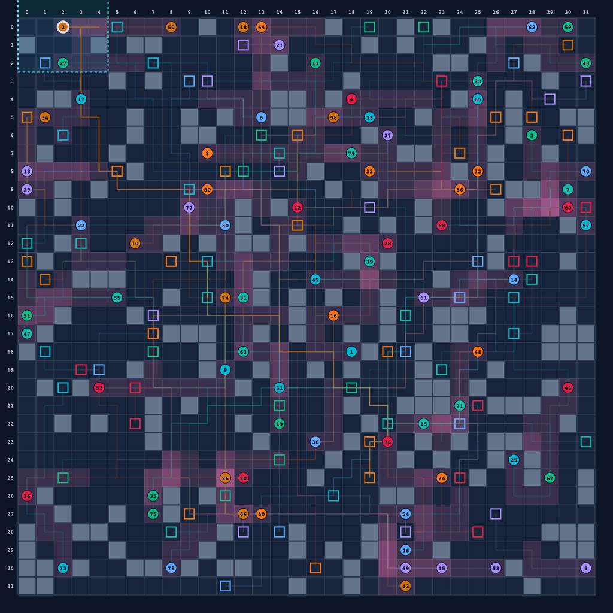

# DEC-MAPF

[](https://github.com/monurkeskin/DEC-MAPF/actions/workflows/ci.yml)
[](https://github.com/monurkeskin/DEC-MAPF/actions/workflows/gui-workspace.yml)
[](https://app.codecov.io/gh/monurkeskin/DEC-MAPF)
[](https://codescene.io/projects/85020)
[](docs/INSTALLATION.md)
[](https://monurkeskin.github.io/DEC-MAPF/)
[](LICENSE)
[](https://doi.org/10.1007/s10458-024-09639-8)
[](https://doi.org/10.1007/978-3-030-82254-5_16)

**DEC-MAPF is a Python simulation and experimentation framework for Decentralized Multi-Agent Path Finding.** Run studies from Python or the CLI, compare methods on shared scenarios, and inspect saved trajectories and decisions in the optional GUI.

The included decentralized methods, HeatMap and PathAware, use token-based negotiation. Centralized methods include CBS and Prioritized Planning, with optional native EECBS/CBSH2-RTC adapters. Additional solvers and coordination protocols can reuse the scenario, execution, validation and analysis services through the [extension interfaces](docs/EXTENDING.md).

DEC-MAPF is [alpha research software](docs/ALPHA-STATUS.md). Record the source revision and effective inputs when running an experiment.

[Get started](#get-started) · [Gallery: article settings](docs/GALLERY.md) · [Researcher guide](docs/README.md) · [Experiment protocol](REPRODUCIBILITY.md) · [Cite](#citations)

[](docs/assets/gallery/negotiation-agent-2-2048.gif)

**Agent 2 in an 80-agent simulation.** 32×32 · approximately 20% obstacles · HeatMap · zero commitment · FoV 5. Agent 2 reaches its goal in 47 actions, participates in five negotiations, and revises its remaining plan on five recorded steps. The replay covers t=0 to t=50; all 80 agents reach their goals.

*The white ring selects agent 2; cyan marks its FoV geometry. Paths and pink heat show executed history and hindsight, not the agent's complete knowledge. This selected, independently valid modern execution illustrates the method, rather than estimating its success rate. [Full-resolution animation](docs/assets/gallery/negotiation-agent-2-2048.gif) · [Still image](docs/assets/gallery/negotiation-agent-2-poster.png) · [Replay evidence and layer guide](docs/GALLERY.md#follow-the-complete-negotiation).*

[Compare methods from the CLI](#headless-your-first-eight-trial-mapf-study) · [Inspect a simulation in the GUI](#gui-run-inspect-replay-export) · [Develop a solver or coordination protocol](docs/EXTENDING.md)

Software checks: [Core qualification](https://github.com/monurkeskin/DEC-MAPF/actions/workflows/ci.yml) · [GUI and packages](https://github.com/monurkeskin/DEC-MAPF/actions/workflows/gui-workspace.yml). Open the checks for the commit you use. They test software workflows; article reproduction requires separate experiment evidence.

## A shared workflow for different methods

| Research task | Starting point |
| --- | --- |
| Study decentralized coordination | Run the included HeatMap and PathAware methods; inspect local observations and interactions |
| Compare against centralized planning | Run CBS or Prioritized Planning on the same scenarios, settings and declared budgets; configure native baselines when needed |
| Add another method | Implement `MAPFSolverProtocol`, register an importable factory and validate its trajectories through the [extension workflow](docs/EXTENDING.md) |

Auction-based coordination and other decentralized protocols can be developed as additional solver implementations. Their coordination rules and method-specific inputs or telemetry need their own implementation and validation; the scenario, batch, result and analysis infrastructure can be reused. See [a new coordination protocol](docs/EXTENDING.md#a-new-coordination-protocol) for the integration boundaries.

<table>
<tr>
<td width="50%"><a href="docs/GALLERY.md#dense-empty-grid-interactions"></a><br><b>80 agents on a 16×16 grid.</b> 16×16, 80 agents, 31.25% initial occupancy.</td>
<td width="50%"><a href="docs/GALLERY.md#actual-local-decision-heat"></a><br><b>Recorded decision weights.</b> Recorded strategy weights and FoV.</td>
</tr>
<tr>
<td><a href="docs/GALLERY.md#what-one-agent-observed"></a><br><b>Recorded local observations.</b> Recipient-local evidence.</td>
<td><a href="docs/GALLERY.md#commitments-with-time"></a><br><b>Timed commitments.</b> Commitments with absolute ticks.</td>
</tr>
</table>

Open the [full gallery](docs/GALLERY.md) for configurations, density definitions, selection rules and replay provenance. These examples show the included negotiation methods in dense shared space and constrained routing. They use the modern implementation and inputs matching the article settings; full-trace recordings preserved the original paths and scientific metrics exactly.

## Get started

Clone the repository, then choose a workflow. Commands below run from the repository root in a POSIX shell. [Installation](docs/INSTALLATION.md) covers environments, Windows, packaged installs and native solver options.

```bash
git clone https://github.com/monurkeskin/DEC-MAPF.git
cd DEC-MAPF
```

### Headless: your first eight-trial MAPF study

Python is sufficient. This tutorial runs HeatMap, PathAware, CBS and Prioritized Planning on the same two small fixtures: eight trials spanning decentralized and centralized methods, saved for analysis and optional GUI inspection.

```bash
uv sync --locked --python 3.12
uv run --no-sync mapf doctor
mkdir -p runs/tutorial
uv run --no-sync mapf batch plan examples/method-comparison.json --output runs/tutorial/manifest.json
uv run --no-sync mapf batch run runs/tutorial/manifest.json --workspace runs/tutorial/workspace
uv run --no-sync mapf batch status --workspace runs/tutorial/workspace
```

The result reports `planned`, `successful` and execution counts. Inspect the saved validation status as well as whether execution finished. Use a fresh directory for a new study, or the explicit resume workflow for an existing one.

The GUI's initial inputs are the named **`interactive-v1`** preset. Python, HTTP and batch specifications can select that same preset explicitly. It is a small interactive starting point, not a paper configuration; [shared presets](docs/API.md#use-the-same-named-preset) explain overrides and identities.

Continue with [headless experiments](docs/HEADLESS.md): build your own matrix, interrupt/resume, export all outcomes, and generate paired analyses and figures. The [16-case smoke example](examples/headless-smoke.json) covers all four physical settings with CBS and Prioritized Planning.

### GUI: run, inspect, replay, export

Install the GUI extra and build the frontend once. Node is used to build the source checkout's UI; it is not needed for headless Python execution.

```bash
uv sync --locked --python 3.12 --extra gui --extra analysis
npm --prefix frontend ci
npm --prefix frontend run build
uv run --no-sync mapf dashboard --host 127.0.0.1 --port 8000
```

Open **http://127.0.0.1:8000**. Choose a scenario, physical setting and solver, inspect **Preview effective inputs**, then **Run simulation**. Use HeatMap to explore local negotiation or CBS for a centralized example. Check **Independent check**, replay with **Step**, select an agent and inspect its evidence. **Compare** aligns saved runs; **Export** provides a checked bundle, SVG, CSV, LaTeX and a standalone HTML replay.

Follow the [illustrated GUI walkthrough](docs/GUI-GUIDE.md) for the complete sequence, custom scenarios, local heat, commitments, comparison and export. To inspect a completed headless study, serve that study's workspace after its CLI runner has exited:

```bash
MAPF_WORKSPACE_DIR=runs/tutorial/workspace uv run --no-sync mapf dashboard --host 127.0.0.1 --port 8000
```

## Research semantics at a glance

| Setting | Wait before reaching the goal? | After first arrival |
| --- | --- | --- |
| 1 | No | Remain at the goal |
| 2 | Yes | Remain at the goal |
| 3 | No | Disappear after the arrival tick |
| 4 | Yes | Disappear after the arrival tick |

`t=0` is the initial state. Costs count actions until first goal arrival. Independent validation checks the roster, starts/goals, obstacles, bounds, adjacency, waits, vertex and reverse-edge collisions, and departure after arrival. **A completed job is not necessarily a valid solution.**

For the included negotiation methods, the default token protocol is `taop-v2`. Standard (SC), dynamic (DC) and zero (ZC) commitments have explicit temporal semantics, including protection during the agreement tick. Process deadlines, bilateral negotiation deadlines, simulation step guards and search limits are separate controls. See [simulation and interpretation](docs/SCIENCE.md), [parameters](docs/PARAMETERS.md), [protocol conformance](docs/TAOP-CONFORMANCE.md) and [metric definitions](docs/METRICS.md).

Native EECBS/CBSH2-RTC profiles have a separate installation and licensing path. Legacy `EECBS-*` Python names denote **SimplifiedFocalCBS** and do not establish the published EECBS algorithm or a certified bound. See the [solver guide](docs/SOLVERS.md).

This implementation is related to the JAAMAS 2024 and EUMAS 2021 papers below. Software checks and the gallery demonstrate current implementation behavior. Historical numerical reproduction requires matching instances, protocol, solver versions, budgets and analysis denominators; consult [reproducibility](REPRODUCIBILITY.md) before interpreting an article comparison.

## Find the right guide

| Goal | Guide |
| --- | --- |
| Install with only the dependencies you need | [Installation](docs/INSTALLATION.md) |
| Learn the GUI with actual screenshots | [GUI walkthrough](docs/GUI-GUIDE.md) · [Gallery](docs/GALLERY.md) |
| Run batches without a browser | [Headless tutorial](docs/HEADLESS.md) · [Experiment reference](docs/EXPERIMENTS.md) |
| Schedule jobs within local CPU/RAM budgets | [Optional resource admission](docs/RESOURCE-ADMISSION.md) |
| Bring your own map, roster or MovingAI files | [Scenarios](docs/SCENARIOS.md) |
| Understand results, limits and fair comparisons | [Scientific interpretation](docs/SCIENCE.md) · [Metrics](docs/METRICS.md) |
| Script the system from Python or HTTP | [Python and API guide](docs/API.md) |
| Diagnose a failure or missing layer | [Troubleshooting](docs/TROUBLESHOOTING.md) |
| Add a solver or coordination protocol | [Extension guide](docs/EXTENDING.md) · [Public API](docs/PUBLIC-API.md) |
| Develop, test or distribute the framework | [Code reading guide](docs/CODE-GUIDE.md) · [Architecture](docs/ARCHITECTURE.md) · [Contributing](CONTRIBUTING.md) |
| Navigate the repository or learn from related tools | [Project map](docs/PROJECT-MAP.md) · [Engineering references](docs/RELATED-TOOLS.md) |
| Understand CI and package delivery | [Distribution checks](docs/RELEASE-CHECKS.md) · [Compatibility](docs/COMPATIBILITY.md) |
| Start an editable study | [New study](docs/NEW-STUDY.md) · [Complete capsules](examples/capsules/README.md) |
| Follow one recorded interaction | [Negotiation walkthrough](docs/NEGOTIATION-WALKTHROUGH.md) |
| Read or search the guides locally | [Documentation site](docs/DOCUMENTATION-SITE.md) |

The full [documentation index](docs/README.md) includes architecture, validation, provenance and method references. The Python framework is [MIT licensed](LICENSE). See [licenses and attribution](docs/LICENSING.md) for the bundled GUI/docs notices and the separate, restricted terms of optional native solvers.

## Citations

If you use this simulation framework in your research, please cite the corresponding publication:

### JAAMAS 2024
```bibtex
@article{keskin2024mapf,
  title     = {Decentralized multi-agent path finding framework and strategies based on automated negotiation},
  author    = {Keskin, M. Onur and Cant{\"u}rk, Furkan and Eran, Cihan and Aydo{\u{g}}an, Reyhan},
  journal   = {Autonomous Agents and Multi-Agent Systems},
  volume    = {38},
  number    = {1},
  pages     = {10},
  articleno = {10},
  year      = {2024},
  publisher = {Springer Nature},
  doi       = {10.1007/s10458-024-09639-8},
  url       = {https://doi.org/10.1007/s10458-024-09639-8}
}
```

### EUMAS 2021 (Second Best Paper Award)
```bibtex
@inproceedings{eran2021token,
  title     = {A Decentralized Token-Based Negotiation Approach for Multi-Agent Path Finding},
  author    = {Eran, Cihan and Keskin, Mehmet Onur and Cant{\"u}rk, Furkan and Aydo{\u{g}}an, Reyhan},
  booktitle = {European Conference on Multi-Agent Systems (EUMAS 2021)},
  pages     = {264--280},
  doi       = {10.1007/978-3-030-82254-5_16},
  year      = {2021},
  publisher = {Springer},
  note      = {Winner of the Second Best Paper Award (Runner-up)}
}
```

Machine-readable citation metadata is available in [`CITATION.cff`](CITATION.cff), [`codemeta.json`](codemeta.json), and [`.zenodo.json`](.zenodo.json).
