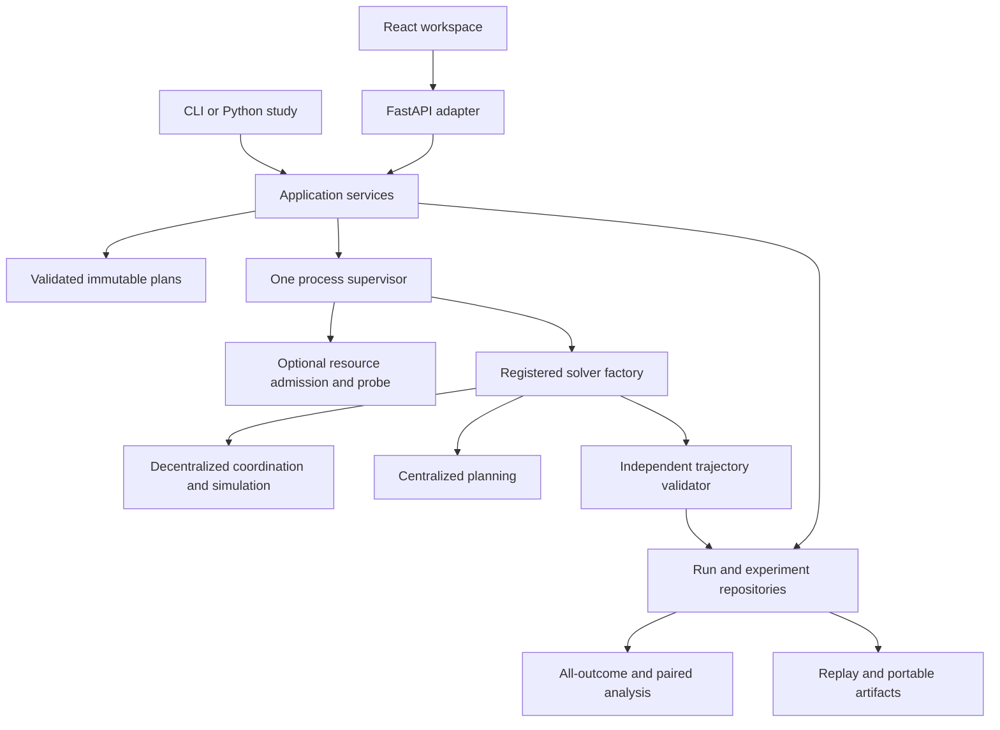

# Architecture and extension boundaries

[Researcher index](README.md) · [Extension tutorial](EXTENDING.md) · [GUI architecture](gui/WORKSPACE.md)

The framework separates shared MAPF problem/result contracts, method implementations,
application orchestration and user interfaces. Decentralized coordination and
centralized planning use the same experiment services. A researcher can run a study
from Python, the CLI or HTTP. FastAPI, React and resource probing are optional adapters.

## Domain boundaries

- `AgentProtocol`, `EnvironmentProtocol` and `MAPFSolverProtocol` define the
  existing strategy/solver contracts. Strategies receive local observations;
  their callbacks do not own the supervisor, database or negotiation ledger.
- `engine/contracts.py:TickWorld` defines the queries and recording operations
  used by pipeline stages. Stages do not mutate private `WorldSimulation` fields.
  The world owns tick advancement, diagnostics, executed history and frame storage.
- The included negotiation protocol owns acknowledgements, commitments and transactional settlement.
  Refactoring a callback must not change conservation, same-tick protection,
  observation isolation or movement settings. Independent trajectory validation
  remains a separate boundary.

`MAPFSolverProtocol` is the shared entry point for another planning or coordination
method. The current decentralized engine composes TAOP-specific stages and agent
callbacks; a new protocol supplies its own coordination logic. It can reuse scenario,
supervision, storage, trajectory-validation and analysis services. Method-specific
parameters, capability descriptors and telemetry need explicit integration; see
[adding a coordination protocol](EXTENDING.md#a-new-coordination-protocol).

## Application and persistence

`ExperimentService` compiles/exercises studies and enforces the declared budget.
`ExperimentStore` defines its persistence operations; `SQLiteExperimentStore`
uses the existing workspace schema. The public `get_manifest()` method returns
the frozen manifest. HTTP and CLI callers do not reach into private service
methods or issue experiment SQL. `RunRepository` continues to own durable jobs,
attempts, scenarios and checked artifacts.

`JobSupervisor` owns worker processes and their lifetime. `ResourceAdmission`
decides whether a queued job may start from a sampled observation; `ResourceProbe`
is its injectable measurement boundary. The optional psutil adapter handles OS
measurements. Tests can supply independent resource observations without changing
solver algorithms or pretending that a simulated pressure test measures performance.

Solver registration supplies constructor bindings, display identity and supported
weight controls. Job defaults/bounds/choices come from `JobSubmissionRequest`, also
used by the GUI descriptors and generated reference. Duplicate names and invalid
direct strategy names fail explicitly. Adding a new research parameter still
requires a versioned input contract and tests; arbitrary unvalidated keys are not
accepted as an extension mechanism.

## Frontend ownership

`App.tsx` composes the workspace and cross-screen selection. `SimulationControls`
owns the configuration form; `useJobMonitor` owns stream/poll lifecycle and cleanup;
`useRunComparison` owns matching requests, stale-response invalidation and alignment.
`ComparisonPanel`, `BatchControls` and `ArtifactPanel` present those workflows.
Draft batch state persists through navigation via `useBatchDraft`. The existing
replay hook owns bounded frame caching, and Canvas rendering remains outside React
state updates. No new UI library or rendering engine is required by this separation.

## Evidence and compatibility

Use the complete qualification commands in [Contributing](../CONTRIBUTING.md).
Behavior-preservation checks compare executed paths, validation, measured metrics
and normalized replay records against an unchanged reference. They supplement
failure-mode, browser and installed-package checks; they do not establish universal
correctness or historical paper-score equivalence. New source bytes have a new
source hash even when finite regression behavior matches. Never update a frozen
running study to the new checkout or relabel its recorded source identity.

## Shared artifact I/O

`mapf.artifact_io` owns canonical JSON encoding and fsynced file replacement. The workspace repository and telemetry logger compose these small I/O primitives independently; importing the simulation or telemetry does not initialize the workspace database layer. The repository retains the existing helper import paths for compatibility. Process-isolated tests enforce that boundary and artifact/lifecycle tests check the unchanged persistence contract.
