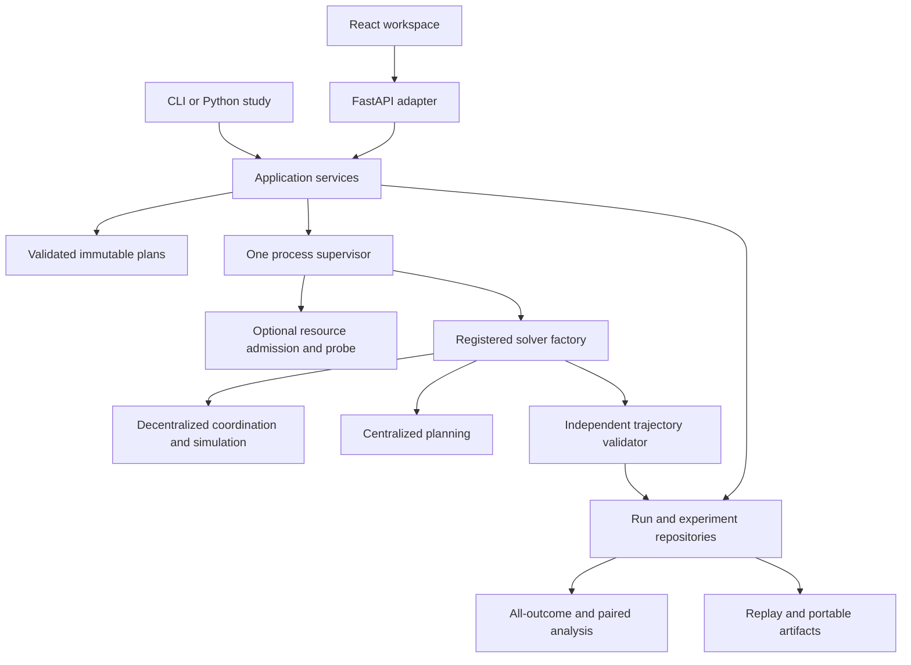

# Architecture and extension boundaries

[Researcher index](README.md) · [Code reading order](CODE-GUIDE.md) · [Extension tutorial](EXTENDING.md) · [GUI architecture](gui/WORKSPACE.md)

The framework separates shared MAPF problem/result contracts, method implementations,
application orchestration and user interfaces. Decentralized coordination and
centralized planning use the same experiment services. A researcher can run a study
from Python, the CLI or HTTP. FastAPI, React and resource probing are optional adapters.

## Domain boundaries

- `AgentProtocol`, `EnvironmentProtocol` and `MAPFSolverProtocol` define the
  existing strategy/solver contracts. Strategies receive local observations;
  their callbacks do not own the supervisor, database or negotiation ledger.
- `engine/contracts.py:TickWorld` defines the queries and recording operations
  used by pipeline stages. Stages do not mutate private `WorldSimulation` fields.
  The world owns tick advancement, diagnostics, executed history and frame storage.
- The included negotiation protocol owns acknowledgements, commitments and transactional settlement.
  Refactoring a callback must not change conservation, same-tick protection,
  observation isolation or movement settings. Independent trajectory validation
  remains a separate boundary.

The five stages exposed by `engine/pipeline.py` compose perception and replanning,
local conflict detection, negotiation, atomic movement, and frame capture. Their
implementations own separate modules; the pipeline controls their order and stops
before later stages when a terminal condition is recorded. Perception and movement
capture every recipient's local view before mutating plans or positions. A failed
joint move does not advance simulated time. Conflict-result caching and sparse
occupancy updates have separate owners, while observation reuse invalidates only
the views affected by changed actors or configuration.

`MAPFSolverProtocol` is the shared entry point for another planning or coordination
method. The current decentralized engine composes TAOP-specific stages and agent
callbacks; a new protocol supplies its own coordination logic. It can reuse scenario,
supervision, storage, trajectory-validation and analysis services. Method-specific
parameters, capability descriptors and telemetry need explicit integration; see
[adding a coordination protocol](EXTENDING.md#a-new-coordination-protocol).

## Application and persistence

`ExperimentService` compiles/exercises studies and enforces the declared budget.
`ExperimentStore` defines its persistence operations; `SQLiteExperimentStore`
uses the existing workspace schema. The public `get_manifest()` method returns
the frozen manifest. HTTP and CLI callers do not reach into private service
methods or issue experiment SQL. `RunRepository` continues to own durable jobs,
attempts, scenarios and checked artifacts.

The HTTP adapter composes separate catalog, scenario, job, experiment, run and
archive route groups. MovingAI imports use the same core parsers as headless
workflows; workspace size limits and immutable snapshot validation remain in the
application layer. Experiment exports capture all planned trials alongside their
paired analysis. Transport code owns SSE delivery and reconnection cursors, while
the repository owns the event journal. Stopping an experiment returns its recorded
final state, including completion that occurred before the stop request.

The HTTP composition root owns one lazily initialized `WorkspaceServices` object.
It synchronizes service creation and releases process ownership on normal or
exceptional shutdown. Request limits and error translation live at the transport
boundary; compatibility routes reuse the same owned supervisor.

Replay separates independent candidate assessment from frame construction.
`SolutionAssessment` records physical validity and first goal arrivals;
`ReplayTimeline` derives positions, lifecycle labels and hindsight occupancy while
preserving the availability of recorded decisions. Checked bundle imports verify
the validation receipt, canonical costs, identities and trajectory-derived frame
fields before saving anything. A matching checksum establishes integrity, not
source authentication or the truth of unobserved solver decisions.

`JobSupervisor` owns worker processes and their lifetime. `ResourceAdmission`
decides whether a queued job may start from a sampled observation; `ResourceProbe`
is its injectable measurement boundary. The optional psutil adapter handles OS
measurements. Tests can supply independent resource observations without changing
solver algorithms or pretending that a simulated pressure test measures performance.

Solver registration supplies constructor bindings, display identity and supported
weight controls. Job defaults/bounds/choices come from `JobSubmissionRequest`, also
used by the GUI descriptors and generated reference. Duplicate names and invalid
direct strategy names fail explicitly. Adding a new research parameter still
requires a versioned input contract and tests; arbitrary unvalidated keys are not
accepted as an extension mechanism.

## File input and search ownership

`core.movingai.parse_movingai_rows` is the shared syntax and coordinate boundary.
It retains typed source metadata so workspace and article admission apply their
own map-reference and selection policies without parsing the text twice.
`core.sampling` owns synthetic generation and its deterministic draw order.
Article dimension repair is explicit and recorded; raw source hashes remain the
hashes of the unmodified bytes. Filtered prefixes and complete archive rosters
retain different eligibility rules and sampling receipts.

`SpaceTimeAStar` is the callable planner boundary. Its per-query `SpaceTimeSearch`
checks legal successors and stop conditions, while `SearchFrontier` owns
cost/heat dominance, parent links and stable heap insertion order. Built-in
reservation queries use primitive tuples; custom reservation methods retain
polymorphic dispatch. Candidate-result memoization belongs to the public planner,
not the frontier. No cache turns a bounded failure into proof of infeasibility.

## Frontend ownership

`App.tsx` composes the workspace and cross-screen selection. `SimulationControls`
owns the configuration form; `useJobMonitor` owns stream/poll lifecycle and cleanup;
`useRunComparison` owns matching requests, stale-response invalidation and alignment.
`ComparisonPanel`, `BatchControls` and `ArtifactPanel` present those workflows.
Draft batch state persists through navigation via `useBatchDraft`. The existing
replay hook owns bounded frame caching, and Canvas rendering remains outside React
state updates.

## Evidence and compatibility

Use the complete qualification commands in [Contributing](../CONTRIBUTING.md).
Behavior-preservation checks compare executed paths, validation, measured metrics
and normalized replay records against an unchanged reference. They supplement
failure-mode, browser and installed-package checks; they do not establish universal
correctness or historical paper-score equivalence. New source bytes have a new
source hash even when finite regression behavior matches. Never update a frozen
running study to the new checkout or relabel its recorded source identity.

## Shared artifact I/O

`mapf.artifact_io` owns canonical JSON encoding and fsynced file replacement. The workspace repository and telemetry logger compose these small I/O primitives independently; importing the simulation or telemetry does not initialize the workspace database layer. The repository retains the existing helper import paths for compatibility. Process-isolated tests enforce that boundary and artifact/lifecycle tests check the unchanged persistence contract.
