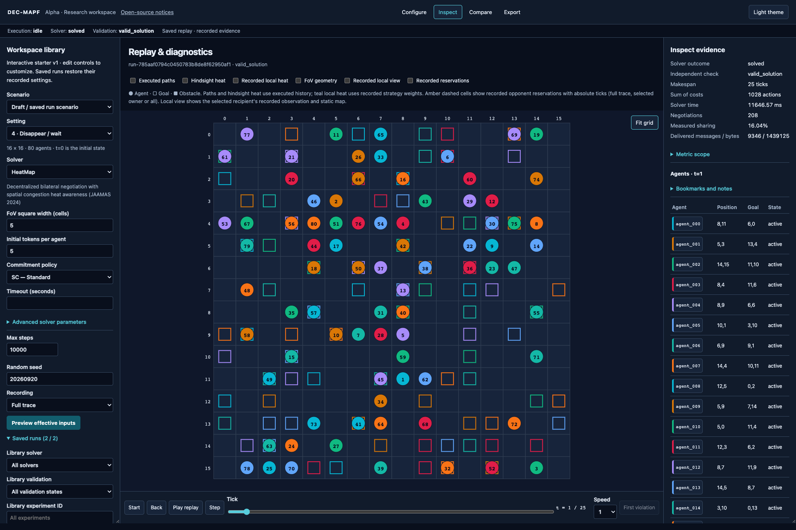
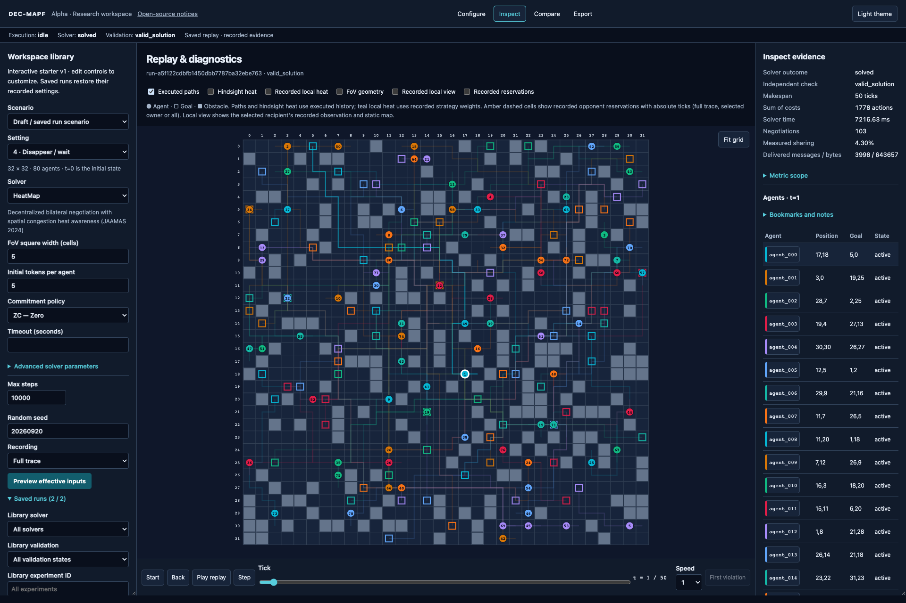
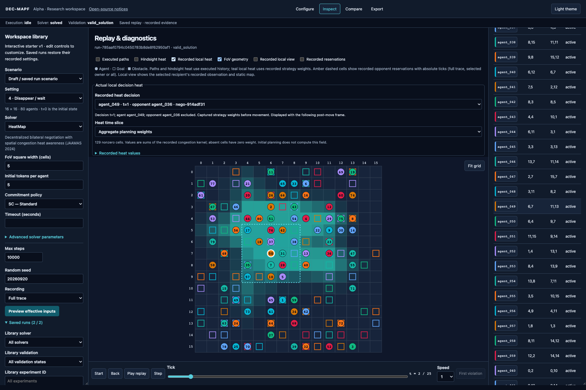
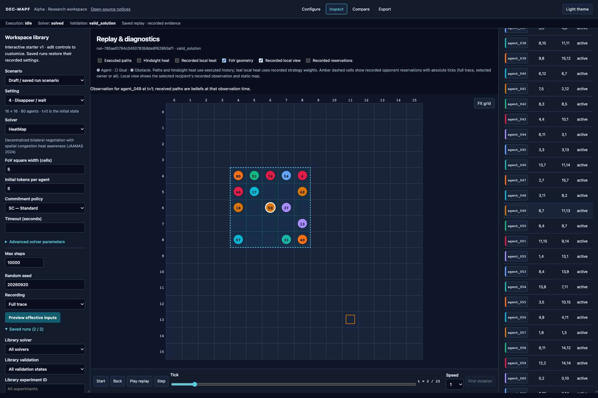
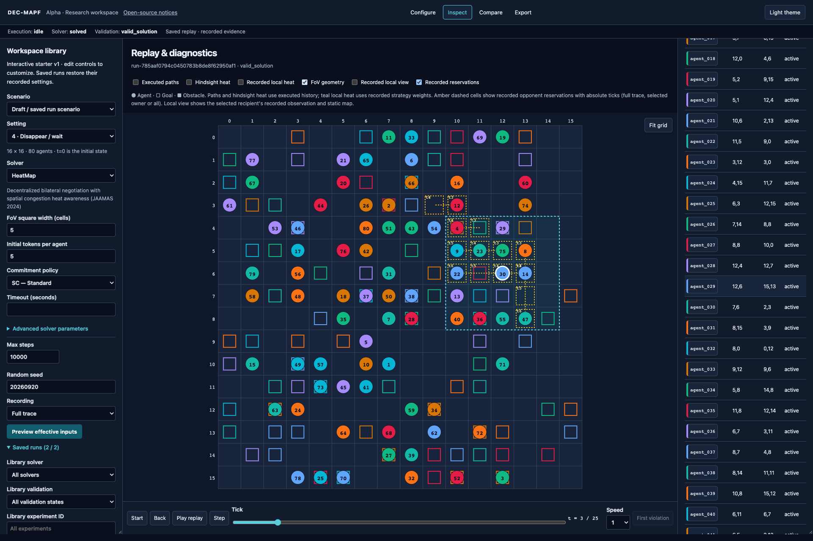

# The visual research workspace

[Documentation index](README.md) · [Installation](INSTALLATION.md) · [Full gallery](GALLERY.md)

Use the GUI to move from a configuration to a checked trajectory, then from that trajectory to the local evidence behind a decision. It reads the same run format as headless batches. Screenshots below are real saved runs from the [documented gallery](GALLERY.md#recreate-the-gallery).

## A first complete workflow

1. Start the server using [Installation](INSTALLATION.md#build-and-start-the-gui) and open `http://127.0.0.1:8000`.
2. In **Configure**, choose **8x8 Grid (4 Agents)**. Select **4 · Disappear / wait**, **HeatMap**, FoV **5**, **SC**, initial tokens **5**, timeout **15** seconds, and **Full trace**. Set **Max steps** to **40**. Keep the bilateral negotiation deadline at **60** seconds. Here the shorter process cap is an explicit tutorial guard.
3. Select **Preview effective inputs**. Read the actual snapshot and configuration, including inactive parameters and resource limits. If you change an input, preview again.
4. Select **Run simulation**. The job has its own process and execution status. A completed job supplies a result; completion alone does not say whether all agents arrived legally.
5. In **Inspect evidence**, check **Solver outcome** and **Independent check**. `valid_solution` establishes the checked trajectory contract for that run. `valid_prefix`, `invalid` and `not_checked` mean something different; see the table below.
6. Replay from **Start** (`t=0`), then use **Step**, **Back**, the tick slider, or **Play replay**. Select an agent in the table or click its grid position. Inspect its goal, token balance, recorded observations and commitments.
7. Open **Export**. Download a **Complete bundle** for re-import and an **Offline HTML replay** for viewing without the server. Use SVG for a vector snapshot and CSV/LaTeX for the recorded run metrics.

**Pause replay** changes playback only. **Cancel** requests termination of an owned solver job. Changing replay speed never changes simulation time, recorded decisions or runtime measurements.

## Understand the preview

Fresh GUI inputs use the versioned `interactive-v1` preset; an opened run restores its recorded inputs. Explicit tutorial choices above override the starter. The **Problem assumptions** card explains four-connected moves, waiting, goal occupancy/disappearance, zero-based coordinates, `t=0`, collision rules and delivered action costs before submission. These are discrete MAPF rules, not a physical-robot dynamics model. Changing a setting invalidates the previous preview.

## Find older runs

Open **Saved runs** in the side panel. It displays loaded and matching totals, initially up to 100 records. Select a solver, validation state or experiment ID and click **Apply library filters**. **Load more runs** makes earlier records available both for inspection and in the **Compare** selectors. **Refresh library** starts a new listing including new arrivals; **Clear library filters** restores the full library.

A comparison selection remains visible if a new library filter excludes it. Library filtering is for navigation; analysis still applies its explicit pairing and denominator policy. Imported copies of one artifact are not independent scientific trials.

## Read status correctly

| Layer | Example | Interpretation |
| --- | --- | --- |
| Execution | `pending`, `running`, `completed`, `timed_out`, `failed`, `cancelled`, `interrupted` | What happened to the job/process |
| Solver outcome | `solved`, `not_solved` | The solver's reported completion outcome |
| Independent check | `valid_solution` | A complete trajectory passed the independent movement/goal checks |
| Independent check | `valid_prefix` | The recorded incomplete trajectory is legal so far; the task is not solved |
| Independent check | `invalid` | At least one checked trajectory condition failed |
| Independent check | `not_checked` | No usable complete candidate/trajectory evidence was available for that check |

The header distinguishes a **Saved replay** from a **Live job**. A saved run can show **Execution: idle** and **Not connected** because no live job stream is active. Its stored result and validation remain available, and playback does not launch a solver.

For invalid trajectories, **First violation** jumps to the earliest recorded violating tick. It is disabled when no violation tick exists. A bounded search failure with no path need not have a collision to jump to.

## Inspect dense interactions

Drag the canvas to pan, use the mouse wheel to zoom around the pointer, and select **Fit grid** to restore the overview. The side panels are resizable. On smaller windows, responsive layout moves panels; a wide desktop makes many-agent inspection easier.

Circles denote agents, outlined squares their true goals, and filled gray cells obstacles. Agent numbers on the canvas are one-based display ordinals, not necessarily the numeric suffix of an agent ID. The table contains the exact IDs and coordinates. The eight-color palette repeats in larger rosters: use numbers, coordinates and selection together. At a distant zoom, labels can be hidden to preserve legibility; zoom in before identifying individual agents.

For dense examples, first turn off **Executed paths**. Select one agent, then enable paths: its trajectory remains prominent and other paths become faint. This makes crossings interpretable without inventing distinct colors for every agent.

*The highlighted line is the agent's full executed trajectory. It is a retrospective view, not a claim that the agent knew its final route at this tick.*

## Choose the right evidence layer

| Control | What it actually shows | What it does not establish |
| --- | --- | --- |
| **Executed paths** | Final recorded trajectories; other paths fade when an agent is selected | The agent's current plan or future knowledge |
| **Hindsight heat** | A visualization derived from executed future occupancy | HeatMap decision inputs |
| **Recorded local heat** | Actual stored strategy weights for a selected agent, decision and relative time slice | A new heat calculation from the finished trajectory |
| **FoV geometry** | A square centered on the selected displayed position, using the run's FoV width | Proof that every globally displayed agent/message was observed |
| **Recorded local view** | The selected recipient's stored observation and delivered message paths, alongside its static map | The global positions of agents absent from that observation |
| **Recorded reservations** | Recorded acceptor obligations over opponent allocations, in amber, with absolute ticks | An unlimited reservation of the winner's entire future path |

Hindsight and local decision heat are mutually exclusive controls. Keep the caption when exporting a figure so a reader knows which interpretation applies.

### Actual local decision heat

Run HeatMap with **Full trace**, select an agent, enable **Recorded local heat**, and choose a **Recorded heat decision**. Use **Heat time slice** to inspect aggregate planning weights or a relative time offset. **Recorded heat values** exposes the numeric cells.

*This screenshot displays the weights for agent_049's decision at t=1 beside the following post-move frame at t=2. The UI states both times. Teal cells are recorded congestion weights; the negotiating opponent is excluded from that field according to the implementation.*

Heat is computed for applicable HeatMap negotiation decisions, not for every agent at every tick or for initial planning. A missing record is not a zero field. The recording budget can omit values, which the UI reports. Events/metrics-only runs and PathAware runs do not supply this HeatMap layer. Within a recorded sparse field, an absent cell has zero weight; that is distinct from the whole field being unavailable.

### Recorded observations and commitments

Enable **Recorded local view** to restrict moving-agent evidence to a selected recipient's recorded observation. Message paths are beliefs at the observation time; a post-move global frame can be one phase later. The static map remains visible. Turn off local view before comparing global trajectories.

Lavender dashed outlines mark previously observed parked cells, including cells
outside the current FoV. These remain known obstacles in settings 1/2. The
**Recorded local observation** data separates `obstacles` (current visibility)
from `remembered_obstacles` (persistent knowledge). A missing/null memory field in
an older recording means unavailable; the viewer does not reconstruct it from
global trajectories.

With **Recorded reservations**, select an agent to inspect the commitments it owns. Amber labels such as `t4` refer to absolute simulation ticks. The selected agent's card exposes **Recorded current plan and commitments** as exact data. SC, DC and ZC have different retention rules; even ZC protects the agreement tick before releasing. See [Scientific interpretation](SCIENCE.md#negotiations-and-commitments).

## Follow a negotiation

The right inspector's **Negotiation sessions** section filters records by session and event category: offers, outcome, delivered messages, token transfers and safety actions. Expand a record to see the actual event fields, utility components and signed balances when those were recorded. Null or missing fields must not be interpreted as measured zero.

Follow the session identity and event sequence, not only the agent pair: the same agents may negotiate more than once. Frame snapshots describe initial/post-move states; session events retain their own decision ticks/phases. Full detail is in the exported bundle and [telemetry schema](gui/telemetry.schema.json).

If a bilateral session exceeds its deadline, the application retains timeout scope and diagnostics, including the last phase, agent, token usage, round and recent action trail where available. This is separate from a whole-process timeout. [Troubleshooting](TROUBLESHOOTING.md) explains how to inspect these cases.

## Compare saved runs

1. Produce two runs of the same scenario, setting, seed and non-treatment configuration. To compare HeatMap with PathAware, change only the solver.
2. Open **Compare**, select **Left run** and **Right run**, leave the treatment as `solver_id`, and choose **Build matched cohort**.
3. Read **Paired**, **Common solved**, **Unmatched** and **Excluded from costs** before interpreting differences. Use the expandable differences/pair records if matching fails.
4. Replay at the same simulation tick. The shorter run holds its final frame and is labelled accordingly. Negotiation-ordinal alignment is descriptive: the two indexed sessions need not involve the same agents.

The eight-trial [method comparison tutorial](HEADLESS.md) supplies two small matched scenarios, each run with HeatMap, PathAware, CBS and Prioritized Planning. Select a decentralized–centralized pair or compare the two negotiation strategies. The gallery's 16×16 and 32×32 instances have different maps and commitments; they are not a matched pair for a solver comparison.

The **Bounded batch**/experiment controls accept experiment specifications and expose complete experiment analysis. A quick pair comparison is not a substitute for a study with all planned outcomes and scenario-level uncertainty. Use the [headless tutorial](HEADLESS.md) for the same operation in scripts.

## Create and preserve a scenario

The editor can change grid dimensions, obstacles and agent starts/goals. Use validation before saving or running; undo/redo operates on the draft. Saving creates a new immutable snapshot. A past run keeps its original scenario, even if you later edit a draft. MovingAI import selects the declared number of leading rows; it does not recover a historical paper sample automatically. See [Scenarios](SCENARIOS.md).

## Export, import and annotate

| Artifact | Use |
| --- | --- |
| Complete JSON bundle | Run metadata, paths, available frames/events, checksums and validation; import into another local workspace |
| Offline HTML replay | Portable interactive viewing without the API server |
| SVG snapshot | Vector depiction of a selected recorded tick; include setting and tick in your caption |
| CSV metrics / LaTeX table | Run-level measurements with availability/validation context |
| Experiment analysis export | Canonical cohort analysis with all-planned inputs and figure/table outputs |

Bundle import verifies integrity and trajectory evidence; it does not certify a paper reproduction. The current UI request/import cap is 16 MiB. For a larger artifact, retain the workspace and use server-backed replay rather than assuming an unlimited browser import.

**Bookmarks and notes** are stored in that browser, with up to 100 recent entries per run. They are not a substitute for the durable experiment journal or an automatically shared annotation database. A `?run=RUN_ID&tick=T` link opens a stored run on a server that has it; a URL alone does not carry its data. Pin useful runs in the library and back up the stopped workspace before cleanup.

## Guided setup and portable inputs

The first-session panel leads from preview to run, independent validation, replay and export. Advanced solver parameters are collapsed initially; opening/closing them preserves their values. The effective-input preview remains authoritative. Open **Run these inputs without the GUI** after preview and choose **Download headless study**. The two displayed CLI commands plan and execute the same scenario and effective configuration; your local source identity and the declared batch allowance are recorded anew.

See the [glossary and legend](GLOSSARY.md) for display terms and the [recorded negotiation walkthrough](NEGOTIATION-WALKTHROUGH.md) for an inspected example.

Next: try your representative scenario and export its checked bundle.
