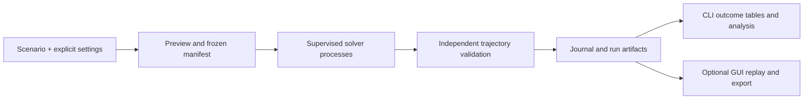

# Find your way through DEC-MAPF

[Documentation index](README.md) · [Architecture](ARCHITECTURE.md) · [Contributing](../CONTRIBUTING.md)

Start with a small, inspectable result. Choose the interface that fits your work; both use the same application services and saved evidence.

## Choose a starting point

| You want to… | Begin with | Check before drawing a conclusion |
| --- | --- | --- |
| Understand one simulation | [GUI walkthrough](GUI-GUIDE.md) | Actual executed moves and the selected method's recorded diagnostics |
| Run a matrix unattended | [Headless tutorial](HEADLESS.md) | Every planned case, explicit budgets and attempt selection |
| Inspect many saved results | [Run library](GUI-GUIDE.md#find-older-runs) | Filters, page count and matching configuration |
| Compare decentralized and centralized methods | [Method comparison](../examples/method-comparison.json), [metrics](METRICS.md) and [experiments](EXPERIMENTS.md) | Common valid solved instances for costs; full denominator for success |
| Add a solver, strategy or coordination protocol | [Extension contracts](EXTENDING.md) | Independent validation, declared information/control model and method identity |
| Diagnose an installation | `mapf doctor` and [installation](INSTALLATION.md#check-your-environment) | Required extras, built assets and workspace schema |

## Repository contents and ownership

| Path | Responsibility | When to use it |
| --- | --- | --- |
| `src/mapf/core/` | Grid, paths, settings, world and independent validator | Reason about discrete problem semantics |
| `src/mapf/agents/`, `src/mapf/negotiation/` | Agent strategies and token protocol | Trace a negotiation decision |
| `src/mapf/solvers/` | Solver adapters and independent validation boundary | Run or qualify an algorithm |
| `src/mapf/application/` | Presets, plans, supervision, journals, diagnostics and exports | Build a GUI-independent workflow |
| `src/mapf/gui/`, `frontend/` | HTTP adapter and optional visual workspace | Inspect the same evidence interactively |
| `examples/` | Small declared specifications and runnable Python examples | Learn or build a minimal reproduction |
| `tests/`, `frontend/tests/` | Behavioral and browser acceptance witnesses | Regress a concrete failure |
| `docs/` | Tutorials, concepts, contracts, gallery and provenance | Interpret features and results |
| `benchmarks/` | Software regression and profiling fixtures | Measure declared engineering workloads; use `mapf batch` for your studies |
| `runs/`, `data/workspace/` | Ignored local outputs, never packaged research evidence | Keep your own manifests and journals |

## What a picture can tell you

The [gallery](GALLERY.md) shows validated modern solutions from two article settings: an empty 16×16 grid with 80 agents and a 32×32 grid with approximately 20% obstacles and 80 agents. It includes selected-agent local heat, recorded observations, commitments and an executed route. Each caption explains the solver, size and evidence. The [gallery receipt](assets/gallery/provenance.json) records run identities and image hashes.

Use a clean position/goal view for a large-map overview, then select one agent before adding paths, field of view and reservations. Use synchronized replay for a matched comparison. A visually attractive, collision-free example does not establish scaling, runtime superiority or reproduction of published scores.

## Learning from other tools

[Related tools](RELATED-TOOLS.md) explains the engineering patterns that informed this repository. Those links are references, not new solver dependencies or claims of comparable experimental tasks.
