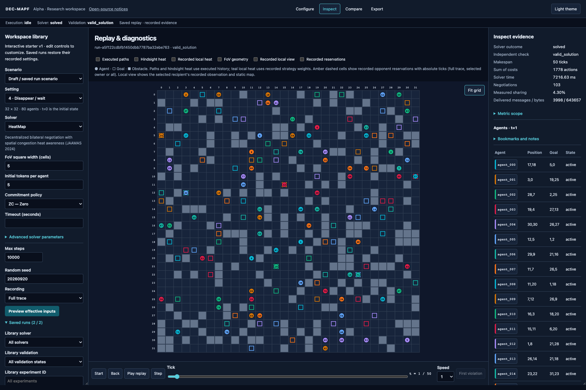

# DEC-MAPF researcher documentation

**Simulate decentralized MAPF, compare methods and develop your own.** Read the [version status and scientific scope](ALPHA-STATUS.md), then choose a workflow below.

DEC-MAPF provides shared scenarios, physical settings, supervised solver execution, independently checked trajectories and a reproducible experiment journal for decentralized and centralized MAPF methods. You can use the entire workflow without opening a browser; the optional GUI adds visual inspection of the same saved runs. The included decentralized methods use negotiation. Additional methods enter through the [solver and protocol extension boundaries](EXTENDING.md).

## Start here

| Your starting point | Follow this path | What you will have at the end |
| --- | --- | --- |
| I want to see the system | [Gallery](GALLERY.md) → [Installation](INSTALLATION.md) → [GUI walkthrough](GUI-GUIDE.md) | A validated simulation, inspected decisions and a portable replay |
| I want to run an experiment | [Installation](INSTALLATION.md) → [Headless tutorial](HEADLESS.md) → [Reproducibility](../REPRODUCIBILITY.md) | A frozen matrix, all-outcome table and qualified paired analysis |
| I want to compare decentralized and centralized methods | [Eight-trial example](../examples/method-comparison.json) → [Solver guide](SOLVERS.md) → [Metrics](METRICS.md) | Matched scenarios, explicit budgets and independently validated outcomes |
| I want to add a solver or coordination protocol | [Extension guide](EXTENDING.md) → [Public API](PUBLIC-API.md) → [Architecture](ARCHITECTURE.md) | A clear adapter, configuration and telemetry integration path |
| I have my own maps and agents | [Scenarios](SCENARIOS.md) → [Parameters](PARAMETERS.md) → [Solvers](SOLVERS.md) | Validated inputs with explicit identities and supported settings |
| I want to use Python or HTTP | [Python and API](API.md) → [Contracts](gui/CONTRACTS.md) | A programmatic run using the same application services |
| I want to contribute | [Contributing](../CONTRIBUTING.md) → [Extending](EXTENDING.md) → [Workspace architecture](gui/WORKSPACE.md) | A tested change with clear scientific and API consequences |

## Understand what the evidence means

- [Simulation and scientific interpretation](SCIENCE.md): ticks, movement settings, negotiations, commitments, validation, costs and denominators.
- [Metric definitions](METRICS.md): measured communication, unavailable values, detours and qualified comparison quantities.
- [Experiment reference](EXPERIMENTS.md): budget enforcement, attempt lineage, stopping reasons and source checks.
- [Reproducibility](../REPRODUCIBILITY.md): what to freeze, what to report, and how article-derived profiles differ.
- [TAOP conformance](TAOP-CONFORMANCE.md) and [centralized conformance](CENTRALIZED-CONFORMANCE.md): exact implementation boundaries and comparison assumptions.
- [Solver identities](SOLVERS.md), [algorithm semantics](ALGORITHM.md) and [native baselines](NATIVE-BASELINES.md): the algorithm behind each name.
- [Citation provenance](CITATION-PROVENANCE.md): stable publication metadata; citations are also in the [README](../README.md#citations).

## Reference and recovery

Use [Troubleshooting](TROUBLESHOOTING.md) for installation, missing replay layers, timeouts, source mismatches and pairing errors. The [parameter reference](PARAMETERS.md) is generated from the current request models. Live HTTP schemas are available at `/docs` and `/openapi.json` on your local server; the versioned [OpenAPI file](gui/openapi.json) supports client generation.

The [gallery provenance](assets/gallery/provenance.json) identifies the actual runs and image checksums. [Documentation verification](DOCUMENTATION-CHECKS.md) records the bounded checks performed for this guide. The [examples index](../examples/README.md) distinguishes runnable experiment specifications from direct Python API illustrations.

## Maintainer and method references

Use the [project map](PROJECT-MAP.md) for repository contents and workflow ownership, [related tools](RELATED-TOOLS.md) for the engineering references, and [CI/distribution checks](RELEASE-CHECKS.md) for package qualification and future release boundaries.

Read [Architecture and extension boundaries](ARCHITECTURE.md) for domain/service
ownership and [resource-aware batches](RESOURCE-ADMISSION.md) for optional measured
CPU/RAM admission in the ordinary CLI and GUI workflows.

The [GUI contracts](gui/CONTRACTS.md), [integration policy](gui/INTEGRATION_POLICY.md), [GUI development environment](gui/BASELINE.md), [Java mapping](MAPPING.md) and [design rationale](DESIGN.md) describe current responsibilities, contracts and scientific interpretation. The [benchmark guide](../benchmarks/README.md) distinguishes software regression fixtures from empirical studies.

*32×32 cells, 205 blocked cells (~20%), 80 agents, HeatMap with ZC and FoV 5. A selected valid modern solution from the article-verification population. [Selection and provenance](GALLERY.md#selection-and-recording) qualify what this example establishes.*

## New-study tools and searchable reading

[Create a study](NEW-STUDY.md), run a [complete capsule](../examples/capsules/README.md), follow [one recorded negotiation](NEGOTIATION-WALKTHROUGH.md), or build the [searchable local site](DOCUMENTATION-SITE.md). The [public API](PUBLIC-API.md), [compatibility matrix](COMPATIBILITY.md), [glossary](GLOSSARY.md) and [maintenance scope](MAINTENANCE.md) make the supported boundaries explicit.

Next: choose the workflow matching your question from the table above.
